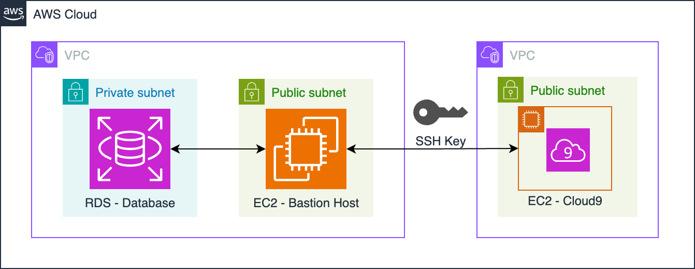

# terraform-bastion-host-dataops
# Implementing DataOps with Terraform: Building a Secure and Automated Data Environment on AWS

[](https://opensource.org/licenses/MIT)

This repository contains the Terraform configuration for deploying a bastion host architecture on AWS to securely access an RDS database within a private subnet. The project demonstrates DataOps principles and Infrastructure as Code (IaC) practices using Terraform. It serves as a practical example of how to automate infrastructure deployment, enforce security best practices like the principle of least privilege, and manage infrastructure state collaboratively.

## Architecture Diagram



This architecture features an RDS database instance hosted inside a private subnet of a given VPC, and an EC2 instance that acts as the bastion host. The EC2 instance resides in a public subnet within the same VPC so that it can receive external traffic from the public internet before relaying the secure traffic to the internal database.

## Project Structure

The Terraform configuration files are organized as follows:
├── modules/
│   └── bastion_host/
│       ├── ec2.tf          # Configuration for the EC2 bastion host instance
│       ├── rds.tf          # Configuration for the RDS database instance
│       ├── network.tf      # Networking resources (security groups, etc.)
│       ├── variables.tf    # Input variables for the module
│       ├── outputs.tf      # Output values from the module
│       └── providers.tf    # Specifies required providers
├── backend.tf            # Terraform backend configuration (S3 and DynamoDB)
├── main.tf               # Main Terraform configuration, calls the bastion_host module
├── outputs.tf            # Main output values (database endpoint, bastion host DNS, etc.)
├── variables.tf          # Main input variables
├── terraform.tfvars      # Example variable values (DO NOT COMMIT SECRETS!)
└── README.md             # This file!
*   **`modules/`:** Contains the `bastion_host` module, which encapsulates the configuration for the bastion host and RDS instance.
*   **`backend.tf`:** Configures the Terraform backend to use AWS S3 for state storage and DynamoDB for state locking, ensuring secure and collaborative state management.
*   **`main.tf`:** The main configuration file that calls the `bastion_host` module and sets up any necessary resources outside the module.
*   **`outputs.tf`:** Defines the outputs of the Terraform configuration, such as the database endpoint and bastion host DNS.
*   **`variables.tf`:** Declares input variables that allow customization of the deployment.
*   **`terraform.tfvars`:** Provides example values for the input variables. **Do not commit your actual `terraform.tfvars` file to the repository if it contains sensitive information.**

## Prerequisites

Before you can deploy this infrastructure, you'll need the following:

*   An AWS account.
*   Terraform installed on your local machine. You can download it from the official [Terraform website](https://www.terraform.io/downloads.html).
*   AWS CLI installed and configured with appropriate credentials. Follow the instructions [here](https://docs.aws.amazon.com/cli/latest/userguide/cli-chap-configure.html)
*   A VPC with at least two public subnets and two private subnets, each pair in a different availability zones.

## Usage

1.  **Clone the repository:**

    ```bash
    git clone <repository_url>
    ```

2.  **Navigate to the project directory:**

    ```bash
    cd <repository_name>
    ```

3.  **Initialize Terraform:**

    ```bash
    terraform init
    ```

4.  **Create `terraform.tfvars`:**
    Create a file named `terraform.tfvars` and add the necessary variable values, including your AWS region, VPC ID, subnet IDs, and desired database name. Here's an example:

    ```terraform
    # Rename this file to terraform.tfvars and update the values accordingly.
    # Do NOT commit your actual terraform.tfvars file if it contains sensitive information.

    region = "your-aws-region" # e.g., "us-east-1"
    vpc_id = "vpc-xxxxxxxxxxxxxxxxx" # Replace with your VPC ID
    public_subnet_ids = ["subnet-xxxxxxxxxxxxxxxxx", "subnet-yyyyyyyyyyyyyyyyy"] # Replace with your Public Subnet IDs (at least two)
    private_subnet_ids = ["subnet-xxxxxxxxxxxxxxxxx", "subnet-yyyyyyyyyyyyyyyyy"] # Replace with your Private Subnet IDs (at least two)
    database_name = "mydatabase"
    database_username = "postgres_admin"
    # database_password will be randomly generated by Terraform
    availability_zone = "your-aws-az" # e.g., "us-east-1a"
    ```
    **IMPORTANT:** Do not commit your `terraform.tfvars` file with actual sensitive data to version control.

5.  **Plan the deployment (optional but recommended):**

    ```bash
    terraform plan
    ```
    This command allows you to preview the changes that Terraform will make to your infrastructure.

6.  **Deploy the infrastructure:**

    ```bash
    terraform apply
    ```
    Terraform will prompt you to confirm the deployment. Type `yes` and press Enter to proceed.

7.  **Destroy the infrastructure (when finished):**

    ```bash
    terraform destroy
    ```
    This command will tear down all resources created by the Terraform configuration.

## Important Notes

*   This code is provided as an example and for educational purposes. It might require modifications to be suitable for production environments.
*   Ensure you have configured your AWS credentials properly before running Terraform.
*   Review the Terraform documentation for more information on the resources and configurations used in this project.
*   The database password is automatically generated by Terraform for security reasons. You can find it in the Terraform outputs after deployment.

## License

This project is licensed under the MIT License - see the [LICENSE](LICENSE) file for details.

## Acknowledgments

*   Inspired by the principles of DataOps and Infrastructure as Code.
*   Built with Terraform and AWS.

---
